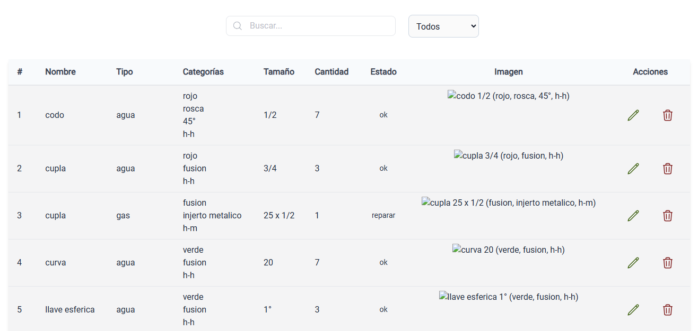

# Contro de Stock

## Astro + React + TypeScript + Nanostores

```sh
cd ./stock-panel/
pnpm install
pnpm run dev
```



## Acerca del proyecto

Aplicación web que gestiona un control del inventario de accesorios.
Tiene la opción de buscar por "Nombre" y filtrar por "Tipo".

## Faltante

- Buscar por la columna "categoría".
  * Selección simple.
  * Selección multiple
- Abstraer componentes
  * Filter...
- Hacer una busqueda multiple con "nombre" y "categoría".
- Hace que funcione los botones de "Editar" y "Eliminar".
- Hacer responsive la Tabla.
- Agregar estilos y reposisionamiento cuando un accesorio es eliminado.
- Agregar estilos a "Estado".
